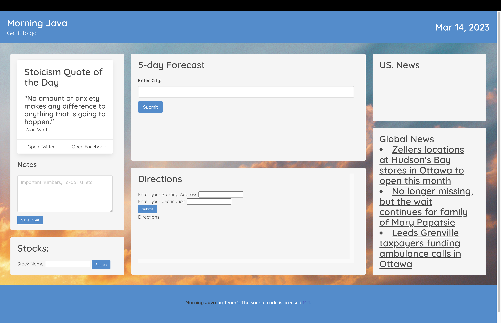

# Morning Java

## Description
This application was made for the conscientious individual to be able to have access to the information needed to start their day. We wanted to give access to US and global news, weather, stocks, and navigation. A tile with a motivational quote, links to social media, and a notes section was also added. 

## Installation

N/A

## Usage

A random Stoicism quote is displayed upon loading the application. Below it is a "Notes" text field where you can enter important information with the ability to save the input. On the Stocks tile, you can search for a specific stock to see it's status. The user can search for a city's 5-day forecast in the top middle tile.  The bottom middle tile contains GPS navigation where you can enter a starting address and destination. US and Global news are available on the two tiles to the right. 

 https://kaylanorris.github.io/morning-java/

## Credits
Collaborators:  
[Danny Clark](https://github.com/djamesclark) -Weather  
[Joseph Flynn](https://github.com/Alphastranger) -Stocks  
[Kayla Norris](https://github.com/KaylaNorris) -Daily Quote/Notes   
[Matt Hough](https://github.com/MatthewH2001) -US News   
[Melena Grilliot](https://github.com/melenagrilliot) -Navigation  
[Clay Moyer](https://github.com/ClayMoyer) -Global News  

Background image credit: https://unsplash.com/photos/vTitvl4O2kE

## License

Please refer to the license in the REPO.

